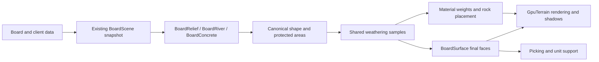

**Hex terrain realism: analysis and implementation plan**

Reviewed 2026-09-26. Scope: analysis and proposed work, not an implemented terrain change. Based on the supplied references, the Gaea and World Creator websites, the current working-tree renderer, and the Short Canyon / Rough captures reviewed in this task. Concurrent renderer work means the baseline must be frozen before implementation comparisons.

Implementation follow-up: the user chose to implement natural material transitions first in `megamek_temp`, then push/pull that milestone into `megamek_gaea` before starting the larger landform work there. See [the transition implementation notes](gpu-terrain-transitions.md) for the delivered scope, checks and remaining limitations; the broader stages below remain a plan.

**Recommendation**

Keep the current hex-constrained terrain mesh and improve the relationship between its shapes, materials, and scattered objects. The highest-value change is coherent weathering across several hexes: a broken crest becomes a gully, the gully ends in a deposit, and both affect the visible materials and rock placement. More small noise, more boulders, or larger textures alone will not achieve the reference look.

Material blending requires a substantial rework both within each terrain family and between different families. Adjacent grass hexes, a sandy plateau meeting its sandy slope, and snow across several elevations must read as continuous terrain, just as snow/grass and sand/grass boundaries must be believable. Include both kinds of transition in the first material milestone, rather than leaving them as final visual polish.

The board remains authoritative for elevation, terrain, water, roads, buildings, movement, and visibility. We can make its visible transitions substantially more natural while retaining readable levels, supported units, sharp construction, and deterministic editing. We cannot reproduce every unrestricted mountain silhouette while also preserving an arbitrary board's discrete heights and usable land. The target is a believable landscape fitted to those constraints.

**What the references show**

The large canyon image supplied by the user is especially relevant. It contains broad, quiet surfaces, groups of smaller ridges, narrow drainage grooves, resistant horizontal beds, and soft aprons beneath hard faces. The details have a hierarchy and a direction. Rock and sediment read as different materials even where their colours are similar. The snow example shows large connected snow patches interrupted by exposed rock; it does not merely paint every upward-facing triangle white. The two small thumbnails support an overall composition comparison, but are too small to justify claims about their fine geometry.

The Gaea 3 page describes guided rivers, sand and snow simulation, terrain displacement, and terrain-specific lighting. It currently labels the product Early Access and warns that some descriptions are still evolving. Its imagery is useful as an art reference; it is not evidence that we can reproduce its rendering cost inside this game. [Gaea 3](https://quadspinner.com/Gaea3)

Gaea's erosion documentation distinguishes wear, transported material, and deposits, and exposes these as outputs used by later stages. It also stresses feature scale and warns against making flow masks overly prominent in texturing. The useful design lesson is to reuse the causes of a landform when shading it. [Gaea erosion](https://docs.gaea.app/reference/nodes/simulate/erosion), [colour and texture workflow](https://docs.gaea.app/using/using-gaea/colorizing-and-textures/index.html)

World Creator describes terrain-aware masks using slope, height, and curvature; material layers; debris and other simulations; and material-aware scattering. Its preview also uses a path tracer. This supports separating geometry, placement masks, and lighting in our analysis. It does not establish that our real-time renderer needs a path tracer. [World Creator features](https://www.world-creator.com/en/features.phtml), [showcase](https://www.world-creator.com/en/index.phtml)

I also inspected the sites' [Gaea rock example](https://cdn.gaea.app/web2026/img/gaea3/gi2.webp), [Gaea snow example](https://cdn.gaea.app/web2026/img/gaea3/snowgi.webp), and [World Creator debris example](https://world-creator.b-cdn.net/assets/img/index/World-Creator-0015.webp). The following conclusions are our visual and engineering assessment, not claims about the vendors' internal algorithms.

| Visible property | Why it matters here | Proposed treatment |
| --- | --- | --- |
| Broad forms survive at a distance | A noisy cliff can still have an obviously hexagonal silhouette | Improve connected crests, recesses, and slope profiles before adding fine detail |
| Uneven feature sizes and spacing | Repeated columns or equally scattered rocks read as a pattern | A few dominant forms, subordinate fractures, quiet gaps, and clustered deposits |
| Grooves connect to deposits | Independent rock, sand, and cliff effects look assembled | One weathering sample supplies the cut, deposition, material, and scatter cues |
| Hard beds alternate with softer retreat | A rock face needs structure beyond random protrusions | Extend the existing bedding/hardness model; keep texture and geometry aligned |
| Soft material accumulates selectively | Uniform borders and white caps flatten the scene | Use slope, shelter, crest/foot distance, and the same deposition cue |
| Surface detail changes with scale | Large cracks and tiny grains should not compete at every zoom | Geometry for silhouettes, normals for smaller detail, filtered textures at overview |
| Rock meets terrain convincingly | Hovering or cleanly perched rocks expose procedural placement | Buried foundations, partial embedding, and debris around appropriate feet |
| Lighting reveals rather than supplies form | Dark cracks painted into everything can conceal weak geometry | Review neutral-material renders as well as final lighting |

**What the current engine already provides**

The implementation is further along than a collection of textured hex prisms. The plan should extend these systems, not build substitutes for them.

| Current owner | Verified responsibility | Consequence for the plan |
| --- | --- | --- |
| `BoardScene` / `GpuBoardSource` | Render snapshots of existing board and client data | Do not introduce a second editable terrain or gameplay model |
| `BoardRelief` | Canonical corners and edges, fixed cliff rows, geology, bedding, caprock, talus, top relief, and rock placement | Preserve stitching and bounds; improve the existing numerical profiles |
| `BoardSurface` | Actual faces, shore and bed geometry, material ownership, support/picking geometry, geometry keys | All visible shape changes must reach these shared faces |
| `BoardRiver` | Connected channel and lake shape | Reuse this for waterways; dry erosion must not invent a competing river network |
| `BoardConcrete` | Constructed outlines and the None / Water only / Everywhere policy | Natural weathering must respect construction and building foundations |
| `BoardRocks` / `BoardFeatures` | Reusable rock solids and deterministic feature presence | Improve selection and placement before introducing new asset systems |
| `GpuTerrain` / `GpuAssets` | Chunk meshes, material binding, texture ownership, render submission | Add data through the existing path and retain its disposal/invalidation rules |
| `terrain-sculpt.frag` and shared lighting includes | World-space material projection, height blending, snow/moss/wetness, light response | Extend one material path; preserve shared colour and lighting conventions |
| `InfantryFootprint`, `UnitGroundContact`, `UnitLandingSupports` | Plateau fitting, infantry footing, vehicle support policy | Consume final geometry; keep Rough clipping rules already requested |

Concrete examples from the source:

- `BoardRelief.profile()` already has retreat, caprock, irregular beds, jointed masses, clefts, and a corresponding deposit term. These are useful foundations. The remaining task is improving their hierarchy, continuity through changing slopes, and reuse by materials/scatter.
- `groundHeight()` already samples world-space relief. `envelope()` attenuates it near constrained seams and unit anchors. The recurring flat areas are partly deliberate support constraints, not simply a missing noise function.
- The renderer uses a 30-metre corner-to-corner hex convention through `BoardRelief.metres()`. Default vertical display scale is independently tunable. Reference mountains must be translated into this scale; a normal cliff hex should not acquire kilometres of visual relief.
- Full geometry uses 12 samples per open edge, more on sculpted cliff edges, and multiple rows per displayed level. Detail currently falls with total board size at 2,500 and 10,000 hexes. It is not a general camera-adaptive terrain tessellator.
- Materials already combine world-space projections and height-based blending. The current manifest contains generated 512-pixel materials, with albedo/height and normal/AO pairs at specified metre repeats. Rock tops now have their own top projection.
- That layer blending is within a selected surface family. `GpuTerrain.byFamily()` groups faces by `BoardSurface.family(face)`, and `sculptMaterial()` binds one family's four roles through `u_sculptFamily`. It does not supply a general neighbour-aware coverage blend for a snow/grass/sand boundary. Cross-family transitions therefore need explicit inputs and binding work; adjusting the existing blend width alone will not implement them.
- The within-family shader also needs review: top, mantle, talus, slope toe, and ledge contributions are computed in successive branches, using different combinations of rim/foot distances, slope thresholds, and texture noise. Some secondary contributions change colour without updating every other surface property. These are concrete places to audit for visible bands, inconsistent relief, and different results where mesh roles meet; existing `heightBlend()` calls are not proof that these joins are realistic.
- Dry terrain lighting is principally diffuse plus shared sky/bounce and shadows; the explicit specular contribution in this shader is for wet films. This leaves room for better material response, but the larger shape issues should be solved first.
- Per-level colour grading deliberately makes higher terrain lighter. That assists tactical reading, but can also exaggerate repeated flat terraces. Its strength deserves an A/B review, not silent removal.
- The sculpt vertex colour and UV channels already carry several meanings, including water data. Additional geological masks need an explicit data contract, not another ambiguous value range.

Relevant source: [BoardRelief](../megamek/src/megamek/client/ui/clientGUI/boardview/gpu/BoardRelief.java), [BoardSurface](../megamek/src/megamek/client/ui/clientGUI/boardview/gpu/BoardSurface.java), [terrain shader](../megamek/resources/megamek/client/ui/clientGUI/boardview/gpu/terrain-sculpt.frag), [terrain materials notes](gpu-terrain-materials.md). Code takes precedence where older notes describe superseded shore constants or behaviour.

**Why the result still looks artificial**

1. **The visible transition pattern is too regular.** Similar-height edges tend to repeat a crest, wall, and apron with comparable prominence. Shared vertices prevent cracks, but continuity alone does not produce a convincing connected landform.
2. **Fine detail is stronger than some larger forms.** Cracks, strata, sand ripples, and repeated small stones can dominate before the viewer reads a slope or ridge. Increasing their contrast makes this worse.
3. **The systems do not fully share their causal information.** A geometric cleft can have a deposit, but texture breakup, vegetation, and scattered rocks also use their own spatial heuristics. They do not consistently tell the same story.
4. **Ground cover and geology are closely coupled.** Grass and snow are surface covers; the exposed rock beneath them should remain coherent. Existing family presets are a useful mapping, but a cover change should not randomly restart fractures or turn boulder tops into the ground colour.
5. **Some rock silhouettes remain recognisably generated solids.** Better texture projection helps, but recurring flat caps, similar dimensions, and regular placement remain visible. Placement and silhouette need separate review.
6. **The support footprint is visible indirectly.** A central area must remain usable, yet the surrounding relief can make it look like a repeated platform. We should disguise that transition through modest, continuous shape and material variation while retaining its actual support limits.
7. **Reference presentation is different.** Promotional close-ups, path-traced light, and unrestricted mountains are not directly comparable to a board overview with units, labels, and game-height constraints. We need quality at normal play distance as well as close-ups.

**Constraints that must survive**

| Constraint | Required behaviour |
| --- | --- |
| Game state | No change to elevation, terrain rules, movement, LOS, water depth, or legal deployment |
| Hex identity | Picking and tactical ownership remain correct even when a natural edge moves visually |
| Natural surface boundaries | Irregular transitions preserve each tile's recognisable terrain type, including isolated patches; their coverage agrees across edges and corners |
| Within-family continuity | Same-family neighbours and top/slope/cliff/deposit joins share consistent material placement and appearance; mesh or hex ownership must not create a visible seam |
| Unit support | Preserve the existing usable plateau and anchor rules; terrain cannot depend on current unit occupancy |
| Rough | Boulders may occupy tile centres; stationary infantry seek gaps or stand on rocks, while vehicles may clip |
| Construction | Preserve concrete modes, sharp None-mode hex edges, isolated concrete hex shape, roads, ramps, and foundations |
| Shores | Keep each bank's material ownership; retain water centres, channel continuity, shallow foam policy, and cliff-into-water tuning |
| Shared geometry | Tops, walls, riverbeds, picking, support, and shadows agree on the same final positions |
| Determinism | Same board and tuning produce the same shapes regardless of build order, camera, or chunk boundary |
| Editing | Changed geometry invalidates every dependent consumer, without treating a visual cache as authoritative state |

**Smallest maintainable design**

Retain the existing pipeline. Add a small amount of shared information where several current consumers actually need it.

Extract the numerical cliff-profile block to a package-private `BoardCliffProfile` only if it can take a small immutable input and remain independent of scene ownership. Move the existing implementation unchanged first. If extraction requires forwarding many scene methods or copying helpers, keep the profile in `BoardRelief` for this milestone. Leave corner identities, edge ownership, seam construction, and shore joins together in `BoardRelief`. Reuse noise/bedding helpers rather than copying them into the shader or a second Java implementation.

The first weathering output should be small: outward displacement plus wear and deposition weights. Existing normal, rim/foot distances, geology, and constraints remain inputs. It can start as a value returned by the profile helper. Only extract a separate `BoardWeathering` helper when the top surface, material path, and scatter all require the same query. No registry, plugin graph, strategy hierarchy, or general-purpose simulation framework is needed.

Compute structural weathering during terrain construction from world coordinates and a bounded board neighbourhood. It is independent of the camera and current animation. The shader consumes its results and adds only fine surface detail. Dynamic rain may wet the result, but changing weather must not continually regenerate the geology.

Prefer two explicit material weights over further packing into the existing overloaded colour channels. If a new two-float sculpt attribute is necessary, account for its eight bytes per vertex, update the vertex/shader binding together, and verify the shadow and fallback paths. Do not add a separate material-mask texture pipeline unless measurements show that the vertex representation is inadequate.

The final mesh remains the surface used for contact and picking. Shader-only displacement that visibly moves the terrain away from that surface is outside the initial design.

**How to improve the shapes**

Use three scales, with initial ranges treated as art-review starting points rather than physical guarantees:

| Scale | Initial role | Representation |
| --- | --- | --- |
| Several hexes, approximately 30–120 m | Broad buttress groups, sheltered recesses, coherent strata and ground variation | Existing world-space shape functions, constrained by board levels and usable land |
| Approximately 1–10 m | Erosion grooves, broken beds, ledges, talus fans, boulders | Actual shared mesh and existing rock kit |
| Below approximately 0.5 m | Grain, small chips, fine cracks and roughness | Filtered material textures and normals |

Replace equally prominent vertical clefts with fewer stronger channels, shorter subordinate cuts, irregular widths, and quiet sections. Let channels taper and wander as they descend, then broaden into deposits where the face relaxes. Use the same feature coordinates and weights for rock exposure and debris placement. Continue strata in world space, including through corners; do not restart beds at a hex's own zero height.

Constrain the result with the existing rim/foot and support rules. Resolve shared positions before tessellating either neighbour. Keep broad profile decisions independent of sample count so lower-detail boards retain the same landform. If a feature is too small for the mesh, move its contribution into material detail rather than introducing unstable triangles.

Tops need restraint: retain their permitted height range and supported area, vary the transition around it, and avoid a visible circular mound or moat around every anchor. Construction remains excluded. Rocks, shallow material variation, and subtle open-ground relief can reduce the visual repetition without consuming more usable land.

**Whether to add real erosion simulation**

The first implementation should improve the existing procedural profile and expose its wear/deposit cues. This is an approximation to weathering, not a hydraulic solver. It offers a controlled way to assess the visual gain without destabilising the board.

If the canyon comparison still lacks connected branching grooves, prototype one bounded erosion pass on a coarse, world-aligned sampling grid. Keep it out of production until it proves worthwhile. It would produce visual wear/deposit cues, retain protected areas, and feed the same mesh and material path. It must not lower gameplay elevations, create new water hexes, or replace the existing river network.

For a chunk implementation, all chunks must start from the same absolute grid and deterministic initial samples. A simulation with N nearest-neighbour iterations needs at least N cells of halo, plus the support radius of its input and later filters. Crop to the chunk interior only after those iterations. Independent erosion per hex, arbitrary overlap, and erosion with a camera-dependent seed are unacceptable. The dependency radius must also enter `BoardSurface` keys and terrain invalidation; the current shore neighbourhood cannot simply be assumed sufficient.

Flat areas and enclosed basins should remain sinks where appropriate. We should not carve an outlet through a protected road, building, or bank merely to keep visual flow moving. Budget the temporary arrays and construction time, release scratch storage after construction, and retain only the output consumers require. If this is too costly or does not improve the agreed comparison, keep the simpler profile solution.

**Materials, cover, and objects**

- Keep the four current material roles: ground, debris, wall, and mantle, but rework how their contributions are resolved and applied. Exposed ridges lose soil; deposits collect finer cover; sheltered patches can retain moisture. The existing order of colour mixes and fixed-width edge treatments is subject to replacement, not merely parameter tuning. Avoid turning each groove into a dark painted stripe.
- Preserve stone-dominant boulders and continuous rock projection. Moss remains a restrained stain. Snow is a cover that collects on suitable facets and in sheltered deposits, leaving meaningful exposed stone. Use the same cues for snow on rock and snow on adjoining ground.
- Make wetting a function of actual water contact or existing weather state. Preserve depth-aware optics and each shore's own material. Do not add a permanent white line to every coast or a beach beneath a cliff when that mode requests a direct rock wall.
- Review the current material source images at their intended metre scale. Keep the generator and manifest as the source of truth. Improve a small set of demonstrably weak materials before increasing every texture to 2K/4K. Imported or authored assets can use the existing loader and manifest; they do not require another asset system.
- Add a restrained dry-surface response only after a neutral-light material comparison demonstrates the need. Start with a per-material roughness value and shared lighting helper; add roughness maps only if the scalar cannot represent the required variation. Preserve the current linear-light/display conversion and test it against other surfaces.
- Keep per-level readability, but compare a less aggressive grade with the current one. Broad geology and cover variation should carry more of the appearance than a brightness change at every integer level.
- Improve boulders through uneven size groups, varied aspect ratios, buried lower faces, and placement near deposits or broken beds. Keep recognizable Rough coverage across the whole tile rather than forcing every Rough rock to a cliff foot. Retain the stable feature seed and unit-clipping policy.
- Vegetation should use suitable cover, slope, and shelter. Use the existing assets, placement, and LOD path. Blanket increases in grass or tree density add cost and can hide tactical information without improving terrain shape.

**Blending within a terrain family**

This is a foundational change. It includes both adjacent tiles of the same family and different surface roles inside that family. Matching texture names or widening a fade cannot by itself make a plateau, its slope, the exposed face, and the deposit below it read as one landform.

| Same-family case | Intended appearance |
| --- | --- |
| Adjacent grass, sand, rock, or snow hexes at the same height | Broad variation and fine detail continue across the join. No tile-shaped tint patches, repeated border treatment, texture-phase reset, or seam in the normal response. Local variation remains, anchored to the landscape. |
| Grassy plateau / earth bank / exposed rock | Turf breaks according to cover depth and exposure; soil persists in suitable recesses while stone emerges. Avoid a uniformly thick brown collar or an identical turf fringe around every level. |
| Sandy plateau / sandstone / loose sand and rubble | Rock ledges and broken fragments relate to the same beds; loose grains gather in recesses and deposits. Texture scale, colour family, and wear connect those forms without a painted horizontal belt. |
| Snowfield / snowy slope / snowy ledge | Snow coverage continues with the landform, thins on exposed surfaces, and accumulates where supported. Avoid independently capped hexes and abrupt changes caused only by triangle slope thresholds. |
| Cliff / talus / surrounding ground | Broken stone grades into smaller debris and then the receiving ground where deposition supports that pattern. Quiet or scoured stretches can have little deposit. A direct cliff-to-water setting still suppresses a beach or apron. |
| Rough boulders / surrounding ground | Embedded lower faces, nearby debris, and compatible surface detail connect the boulders to their setting. Preserve stone-dominant rock, intentional rock boundaries, whole-tile Rough coverage, and unit footing rules. |

Resolve the role contributions from the shared geometry and coverage cues in one place, with explicit priority for cover over its substrate. Reuse that result for colour, normal detail, cavity/AO, and the material response. Consolidate the existing separate treatments as they are replaced instead of stacking another correction over each of them. Family presets supply restrained differences; they do not need separate blending implementations.

Rim distance, foot distance, and surface inclination are useful constraints, but they should not alone prescribe a constant-width layer around an entire hex. Combine them with coherent exposure, wear, and deposition. Use material height detail for small irregular edges after the larger coverage is resolved. Review the current `heightBlend()` function and its inputs; retaining it is conditional on the visual result. Calibrate source height ranges so an asset's alpha contrast does not accidentally decide which material dominates every join.

Across mesh roles, reconcile projection, metre scale, normal orientation, cavity strength, and colour treatment. A horizontal surface turning into a slope should not reveal a switch to a stretched or differently scaled texture. Top and side projections can remain different where appropriate, but their change must follow the actual surface. Neighbouring samples on the same continuous natural surface must agree on coverage; genuine sharp rock faces and constructed corners retain their intended discontinuity.

Keep broad variation in shared world coordinates and use stable feature seeds only for objects that need them. Review per-level grading at these joins as well: tactical height readability remains a requirement, but grading must not accidentally expose the boundary between top and cliff shading. At overview distances, filter fine breakup while retaining coherent larger coverage, rather than reverting to visible rings or causing blend boundaries to pop.

Start by showing one family continuously across flat ground, a slope, a cliff, its deposit, and a Rough patch. Approve that result before adding cross-family boundary sampling. Both use the same revised material evaluation, so there is one blending foundation to maintain. Material-only changes preserve geometry; any improved deposit silhouette belongs in the shared geometry path.

**Transitions between natural surface families**

Aim for a change in coverage and surface structure across the boundary. A uniform colour fade leaves a visible hex-shaped band and can turn snow, grass, and sand into an indistinct intermediate material. The following are proposed visual treatments, controlled by available terrain and weather cues rather than a new climate simulation:

| Boundary | Intended appearance |
| --- | --- |
| Snow / grass | Connected snow patches break into smaller remnants toward the grass; grass and soil emerge between them. Sheltered hollows retain more cover, exposed ridges less. Dark damp ground appears only where wetness or melt cues justify it; there is no compulsory mud stripe. |
| Sand / grass | Sand occupies irregular tongues and pockets between thinning grass clumps. Vegetation coverage changes with the ground coverage, with a restrained soil mix where appropriate. Avoid a continuous green-to-beige gradient or identical fringe around every tile. |
| Grass / dirt | Turf breaks into clumps over exposed soil, then becomes sparse. Colour, normal detail, and vegetation density follow that coverage together. |
| Soil or sand / rock | Thin material fills cracks and recesses while higher rock remains exposed. Larger deposits collect at suitable feet, using the existing wear/deposition cues. |
| Snow / rock | Snow rests on suitable ledges and hollows with broken edges; steep faces and prominent facets remain visibly stone. Ground and boulder snow use compatible coverage. |
| Natural ground / construction or water | Preserve the constructed outline and each shore's material ownership. Concrete modes still determine shape; natural blending does not erase slab edges, roads, or foundations, or smear one bank's material across a water hex. |

Use one shared coverage calculation with a few cover properties, not a separate algorithm or asset for every material pair:

1. Derive the participating covers from existing board neighbours and the actual surface contact. Equal-level ground can blend across its join. A cliff, retaining wall, road, or water gap changes or blocks that contact; proximity in XY alone must not paint an upper plateau onto the surface below it.
2. Evaluate a bounded transition region in world metres using canonical edges/corners and deterministic world-space variation. Both sides must obtain the same coverage at the same shared position, regardless of tile or chunk build order. Same-family joins use the continuous material evaluation above, without adding a border fringe. Limit cross-family influence to retain readable tile interiors and isolated terrain patches.
3. Shape coverage with the available slope, shelter, and shared wear/deposition cues. Use larger connected patches with smaller edge breakup; permit asymmetric transitions such as snow lying over grass. Keep structural coverage stable as the camera moves or wind animation advances. No new wind or melt simulation is required.
4. Normalise all active family contributions at junctions, including three-family corners. Do not choose one dominant neighbour for an entire hex or independently overlap six edge strips. Every boundary must terminate and join consistently.
5. Apply coverage to complete surface appearance: colour, height-based layer selection, normals, and the applicable AO/roughness response. Blend before shared lighting, using its colour-space conventions. Feed the same broad coverage to vegetation placement so grass does not stop at a different line; boulders retain their stone substrate beneath any cover.

Keep these weights separate in meaning from wear/deposition: one describes which cover is present, the other describes what shaped the surface. They can share the existing geometry-construction lifetime and cache ownership. If rendering and scatter both need the coverage query, a small package-private helper is justified; a biome registry or a second editable terrain map is not.

Build surface-cover transitions on the revised within-family material evaluation. Reuse existing assets and projection helpers where they meet the quality target; the current blending formulas are not a fixed constraint. Uniform interiors use that revised family shader without unnecessary neighbour sampling. Audit the texture-unit and vertex-data budget, including lighting/shadow inputs, before choosing the boundary binding: do not bind multiple complete four-role families everywhere or create a material instance per hex. Reuse identical maps and bind only the roles needed by the transition. The prototype must demonstrate both a two-family edge and a three-family corner within that budget.

This first transition pass changes material coverage and scatter, not terrain elevations. Any later snow thickness or deposit geometry must enter `BoardSurface` and its support/picking path. Include neighbouring surface changes in material and scatter invalidation, and compare local edits with a clean rebuild. An optional transition control should follow the existing tuning pattern; avoid one slider per material pair.

**Implementation sequence and review gates**

| Stage | Concrete deliverable | Primary files | Gate before proceeding |
| --- | --- | --- | --- |
| 0. Fix the comparison | Saved camera/light/tuning states, frozen revision, neutral-material and final captures, timing baseline | Existing terrain showcase, detail, benchmark, and performance smoke tests | Repeat runs reproduce the same appearance; unrelated startup failures are excluded from the terrain assessment |
| 1. Isolate the numerical profile where useful | Move profile/bedding calculations behind the small helper only if it simplifies the work; preserve all results | `BoardRelief`, new `BoardCliffProfile` if extraction stays simple | Geometry tests and representative screenshots remain equivalent; no duplicated noise or topology logic |
| 2. Improve one canyon | Broader coherent forms, less regular grooves, connected deposits, preserved plateau | Profile helper, `BoardRelief`, existing geology tuning | Better silhouette in neutral material at normal play distance; no folds, support loss, or shore cracks |
| 3a. Rework within-family blending | One coherent material evaluation connects same-family hexes and ground, slope, cliff, mantle, talus, and Rough rocks; wear/deposition inform shading and placement | `BoardRelief.Shade` and rock placement, `GpuTerrain` vertex/binding path, `terrain-sculpt.frag`, existing material assets | No artificial collars, role seams, projection jumps, or colour-only overlays with contradictory relief; normal play and overview captures approved |
| 3b. Extend it across natural families | Neighbour-aware coverage produces snow/grass and sand/grass transitions, including a three-family corner, using the same revised evaluation | `BoardSurface` neighbour inputs, shared coverage helper if needed, `GpuTerrain` bindings, shader, existing vegetation placement | Geometry, material and vegetation cues agree; no hex-shaped fade bands or corner seams; texture-unit and draw-cost budgets checked |
| 4. Finish the surface families and transitions | Sandstone, grass/rock, dirt, snow; extend shared coverage to the remaining natural boundaries and refine texture scale/material response | Existing geology presets, shared coverage helper if needed, shader, material generator/manifest | Each family and boundary is convincing in top and oblique views; isolated patches remain readable; mixed shores and construction are intact |
| 5. Validate contact and edits | Actual infantry/vehicle/bridge/building cases; changing terrain and switching boards | Existing support, picking, and geometry-cache paths | No floating units, contradictory picking, stale masks, unsupported rocks, or unbounded caches |
| 6. Ship within measured cost | Reuse current detail tiers, profile close/overview/pan, tune defaults and expose the useful control | `GpuTerrain`, tuning UI, existing benchmarks | No geometry generation during steady camera motion; cold load, local edits, CPU/GPU cost and memory are reported |

The bounded erosion prototype is a conditional experiment after stage 2, not a prerequisite for all later work. Each stage should be a reviewable change with a visual comparison. Do not combine a topology rewrite, material replacement, and lighting rewrite into one change.

For tuning, reuse the existing Terrain/Geology controls. If a new global control is useful, prefer one **Natural weathering** strength whose zero value gives the existing result, backed by one named default constant. Its scope is natural terrain. It must not override concrete modes or cliff-into-water policy. Avoid a new checkbox for each internal mask or geological term. Keep experimental defaults off until the comparison and regression gates pass.

**Verification matrix**

| Fixture | What it catches |
| --- | --- |
| `Deserts/16x17 Mines 1.board` | Sandstone hierarchy, terrace colour, cliffs, and irregular shores |
| `unofficial/Carpe Mortis/16x17 Short Canyon.board` | Grey stone under grass, Rough integration, cap/face/foot continuity |
| Existing isolated Rough fixtures at positive and negative elevations | Lost rocks, excessive foundations, snow contrast, and plateau constraints |
| `test_board.board` plus deterministic mixed-depth fixtures | Negative water levels, variable depths, cliff ends, transitions, and mixed shore materials |
| Both AeroBases and the dock-pattern fixtures | Crisp construction, all concrete modes, foundations, and material borders |
| Synthetic cliffs in all six edge directions and multi-height corners | Direction bias, cracks, inverted faces, coincident seams, and dependency boundaries |
| Single-family grass, sand, rock, and snow scenes spanning same-height neighbours, slopes, cliffs, deposits, and Rough patches | Artificial collars, per-tile variation resets, role/projection seams, discontinuous normals or cavity strength, and overview blend popping |
| Snow/grass and sand/grass edges in all six directions, three-family corners, isolated patches, and alternating narrow regions | Shared coverage, no repeated fade bands, readable terrain identities, consistent vegetation, and stable overview filtering |
| Natural boundaries crossing slopes, cliffs, chunk seams, and constructed edges; mixed-material water hexes | Contact-aware coverage, correct material ownership, protected hard edges, and local-edit invalidation |
| Existing infantry Rough and river-plateau native scenes | Clear-gap fitting, fallback footing, vehicle clipping, and unchanged support safety |
| Frozen small and 200×200 boards | Startup, edit radius, allocation, memory lifetime, draw count, and camera cost |

Review every representative scene at overview, normal play zoom, and close-up; use top and oblique cameras with identical sun and weather. Compare with the grid/labels present, and also in an unobstructed inspection view. Better screenshots obtained only by hiding tactical information do not satisfy the target.

Automated geometry checks should cover shared positions, winding, finite normals, bounds, protected area retention, and correspondence between rendered surface and support. Rebuild the same fixture in different orders and across chunk boundaries. Test a board edit against a clean rebuild, including any newly extended weathering dependency radius.

Native checks should compile the real shaders, render all surface families, validate material and mask binding, and exercise board swaps and resource disposal. Use current CPU/GPU stage timers. Do not infer a GPU bottleneck from FPS alone.

For within-family blending, inspect colour, normals, and coverage separately as well as the lit result; identify any discontinuity caused solely by tile ownership or mesh role. Include a continuous terrain ramp through the relevant slope thresholds, plus discrete game-level steps, to catch sudden changes in coverage. For cover transitions, check finite normalised weights, the same result from either side of a shared edge/corner, absence of influence across blocked contacts, and preservation of an isolated tile's identity. Compare a cover edit against a fresh board rebuild. Native captures must verify patch scale, normal/material continuity, vegetation agreement, and three-family corners across chunk boundaries; numerical weights alone cannot establish that the result looks believable.

Performance acceptance must be based on a frozen baseline on the same hardware. Record initial construction, a local edit, memory, draw calls, and median/p95 frame time for overview/close/pan. The existing performance report documents substantial construction costs on large maps; uniform tessellation or whole-board erosion is therefore a poor starting point. Those historical timings are context, not a fresh measurement of this plan. [Existing performance investigation](gpu-board-performance.md)

**What to defer**

Do not start with a full heightfield replacement, voxel terrain, an open-world streaming system, runtime hydraulic simulation, a node editor, a terrain-plugin framework, ray/path tracing, virtual textures, or blanket density increases. Camera-adaptive tessellation also adds seam and support complications; keep the present board-wide tiers until a measured need justifies it.

Gaea or World Creator could later be useful offline for authoring tileable geological detail or reviewing erosion motifs. The first implementation needs no purchase, runtime dependency, exporter, or integration with either application. Any eventual imported height/detail map remains an asset constrained by the existing board; it cannot become a competing authority for game heights.

**First practical milestone**

One frozen canyon scene containing a multi-hex cliff, an exposed upper surface, a debris foot, a Rough patch, and a river contact, accompanied by a compact snow/grass/sand transition fixture. Deliver a before/after comparison in neutral material and in the final material pass, plus seam/contact tests and measured cost. The canyon must demonstrate both connected shapes and the within-family blending rework: ground, slope, rock, and debris read continuously without artificial collars or role seams, while retaining the same board, unit space, waterways, and concrete behaviour. The transition fixture should show irregular cover, matching vegetation, and a clean three-family junction. Validate both before rolling the approach out across all families.
